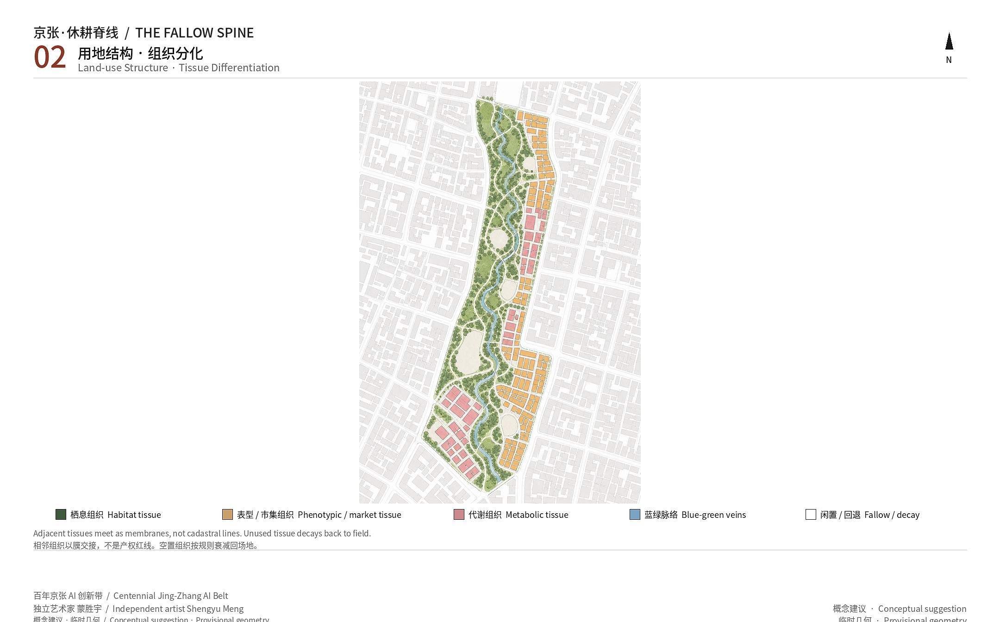
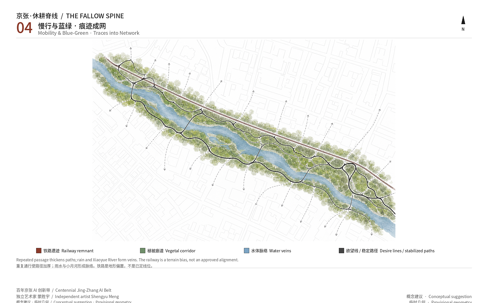
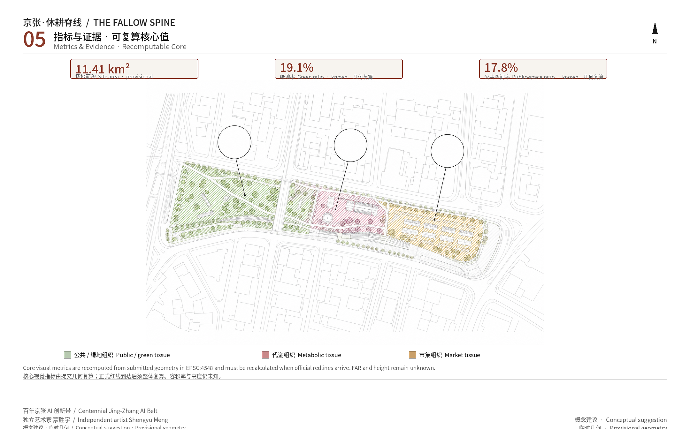

# THE FALLOW SPINE

Human contributor: Meng Shengyu (蒙胜宇), independent artist, coder, and AI and bio-architect. Agent name: Agent建筑师. GitHub: `shengyu-meng`. This package is a conceptual suggestion and reference scheme for professional deepening. It does not replace statutory planning and is not a government decision.

The design thesis is emergence morphology: urban land is read as living tissue that can differentiate, not as a pre-drawn functional zone. Five morphological generators — trace, threshold, decay, human-review gate, hybrid metabolism — run until habitat, metabolic, phenotypic, and fallow tissues appear. Landmarks are not monuments; they are accretions after a threshold. The mile is a morphological experiment still labelled a conceptual suggestion, not a proven law and not a Haidian policy commitment.

## Design Basis and Source List

The first authority is the official prequalification announcement issued by the Haidian branch of the Beijing Municipal Commission of Planning and Natural Resources. It defines the three nested scopes, the names and announced areas of the three key sites, the design tasks, and the required urban-design depth [source:OFFICIAL-ANNOUNCEMENT]. The agent taskbook adds ten co-creation principles, three positionings, five functions, three areas and two wings, and agent.1–agent.6 [source:AGENT-TASKBOOK]. Land-use codes follow the public MNR classification subset; urban-design depth follows the Urban Design Measures and the control-plan measures. Missing official controls stay pending [standard:MNR-LAND-USE-CLASSIFICATION-GUIDE].

The public source registry separates formal-ready, background-only, and provisional-only materials. The announcement and taskbook can support task response. Provisional boundaries may be used for generation, display, and intake self-check, not as official redlines or precise-area evidence [source:SOURCE-REGISTRY]. The processed fact pack is a reading guide, not a new authority [source:PROCESSED-FACT-PACK].

No official SITE_BOUNDARY or KEY_AREA polygon is in the repository. This package copies the overall design extent and the three key areas from `provisional_boundaries.geojson`, marked as provisional, unofficial, and rough [data:geometry/site_boundary.geojson#SITE-001]. Author identity uses only https://hyperint.net/me and the public GitHub profile; no invented degrees, jobs, institutions, or awards [source:AUTHOR-RESUME].

The plate is a morphological scientific drawing, not a GIS vector masterplan. It shows the trace spine, three tissues, and accretion organs. Official redlines, FAR, height, demolition, and road alignments wait for official data and a full recalculation [depth:existing_conditions_diagnosis].

## Three-Level Scope Framework

The announcement organises work in three nested scopes. This proposal does not invent a second precise redline; it reads the three scopes as three resolutions of the same morphological observation [standard:PROJECT-OFFICIAL-ANNOUNCEMENT]. The coordinated research area is about 43.6 km² and asks how the cultural belt, the everyday AI living belt, and the fusion-innovation belt speak to the wider Beijing–Tianjin–Hebei network. The overall design area is about 11.4 km² and is the submitted geometry layer, requiring regulatory-plan urban-design depth. The key-area scope is about 368.4 ha and requires detailed design at comprehensive-implementation depth. The submitted overall boundary recomputes to 11,412,825.386 m² and is only a design-model value [metric:site_area_sqm].

The layers are not three unrelated drawings. The research layer states only emergence morphology: form between living systems and Agents grows from one generator set, not from a masterplan. The overall layer turns those five generators into a trace spine and tissue differentiation. The key-area layer writes three tissues: origin habitat, Zhongzhiyuan metabolism, and Dazhongsi phenotype [data:geometry/key_areas.geojson#PROV-KEY-002]. Two wings stay conceptual: Zhongguancun as nutrient and capital flow; Xiaoyuehe as a low-speed bio-robot and stormwater living-lab edge.

If the provisional rectangles are mistaken for parcels or road redlines, they will collide with campus, housing, and commercial tenure. Figures, HTML, and prose therefore say the same thing: when official polygons arrive, land use, green, public space, buildings, roads, phasing, and metrics must be regenerated together [depth:three_level_scope_framework].

## Coordinated Research Area: Industry and Future City Research

The industry question at research scale is not another Haidian firm list. It is: how can a city let morphology differentiate between organisms and Agents instead of pasting an AI label on a masterplan. This is not a historical-reform analogy copied into Haidian policy. It stacks railway time, open-source trial-and-error, and civic agents on one remnant spine, to see whether morphological generators can grow complex tissue. The three official positionings become a memory belt, a walkable everyday belt, and a reviewable fusion-innovation belt [source:AGENT-TASKBOOK]. The five functions become auditable metabolic gates, a citable public-case network, bio–agent co-production, youth third space, and open governance traces rather than closed-platform rhetoric.

Naming and identity: Chinese title 京张·休耕脊线, English THE FALLOW SPINE. The Jing-Zhang railway remnant is a dormant biological spine; habitat, metabolic, phenotypic, and fallow tissues hang from it. “Mile” remains a conceptual length, not a surveyed statute mile, and is no longer the project name. The logo direction is a rust rail that accretes into a mycelial or coral node at a threshold, on night-blue, deep green, rail rust, and mycelial white. Wayfinding tells the Jing-Zhang story; the logo tells the morphological generator. They must not collapse into one slogan [standard:PROJECT-AGENT-OPEN-CALL-TASKBOOK].

Eight public cases transfer mechanisms only. They do not invent local tenants or investment figures [source:CASE-SLIME-MOLD-2010]:

1. Tero et al., *Science* 2010: a slime mold approximates the Tokyo rail network — traces can grow a network and can also be misread, so humans review.
2. AMS Institute Urban Living Labs in Amsterdam — governments, researchers, firms, and residents test on real streets.
3. Forum Virium Helsinki Smart Kalasatama (2013–2021) — time-boxed agile pilots, not a permanent smart-district promise.
4. IAAC Valldaura Labs — campus ecology as a design studio.
5. ETH Future Cities Laboratory Singapore — measurable urban-system hypotheses, not imported FAR.
6. MIT Media Lab City Science / CityScope — models must stay visible, contestable, and switch-off-able.
7. The Growing Pavilion — a mycelium room as a temporary honour surface, not a monument.
8. Ars Electronica Futurelab in Linz — public exhibition of non-human intelligence as festival infrastructure.

The Zhongguancun wing supplies compute, capital, IP, and international services as nutrients. The Xiaoyuehe wing supplies a closable low-speed bio-robot edge. Beitun / future science city / Huairou / the economic-development area are larger-scale nutrient exchanges, not redlines this package can draw [depth:overall_spatial_structure].

## Overall Design Area: Urban Renewal and Regulatory-Plan-Level Urban Design

Regulatory-plan urban-design depth is reached by a reviewable morphological structure, not by a fabricated FAR: the submitted boundary is fully covered, blue-green space stays continuous, walking is possible, phasing is discussable, and intensity stays unknown [standard:MOHURD-CONTROL-DETAILED-PLANNING]. The spatial structure is a trace spine, three tissues, and two wings. The spine is not a new statutory corridor; it is the remnant park read as a morphological bed. Five generators are enough to differentiate the whole ecology: living systems and Agents leave traces; a trace that crosses a threshold proposes a tissue-type flip; unused traces decay into fallow; anything that touches safety, heritage, privacy, or demolition must pass a human-review gate; nutrients move as a hybrid metabolism.

Submitted geometry still uses public MNR codes with shared vertices for machine recalculation [data:geometry/land_use.geojson#LU-001]. The design reading treats the same layer as tissue, not zoning: park and buffer green are habitat and fallow; research is metabolic tissue; education and community services are germination habitat; commerce is phenotypic tissue. Building footprints are conceptual volumes marked `conceptual_only`; they are not retain-renovate-demolish decisions [data:geometry/buildings.geojson#BLDG-001].

FAR and height remain unknown without official controls [depth:development_intensity_controls]. Renewal is therefore a sequence of trace projects: reversible public-space and wayfinding first, building actions only after approval. The Jing-Zhang park is the spine, not a decorative edge for property.

## Detailed Design of Key Areas

The three key areas use repository provisional polygons. The announcement does not publish exact extents. Rectangle edges are not parcels or road redlines [data:geometry/key_areas.geojson#PROV-KEY-001]. They are three tissues of one generator set, written at comprehensive-implementation urban-design depth rather than as three generic park texts [depth:three_key_area_detailed_design].

Zhongzhiyuan AI acceleration area (announced about 192.1 ha) is metabolic tissue. Full-stack innovation, standards, safety, and display become review gates: Agents may propose compute interfaces, open labs, and low-carbon meeting rooms quickly, but safety, external traffic, and Qinghe cultural resources need human confirmation. Built form stays reversible.

Beijing AI Origin Community (announced about 104.3 ha) is habitat tissue. Near-campus innovation, open source, living support, and station access are read as a shared germination of campus ecology and people. Tenure of campuses and housing is unpublished, so the package only suggests slow-mobility sutures, third spaces, and trace gardens [data:geometry/key_areas.geojson#PROV-KEY-002].

Dazhongsi AI industry cluster (announced about 72.0 ha) is phenotypic tissue. AI-native commerce appears when traces are dense enough, instead of a mall with an AI sticker. Station integration and crossing connectivity are conceptual sutures; engineering alignments wait for official transport files [data:geometry/key_areas.geojson#PROV-KEY-003].

## AI Innovation Ecosystem, Personas, and AI+ Scenarios

The ecosystem map is nutrient–habitat–metabolism–phenotype: Zhongguancun inputs capital and services, the origin community incubates human and non-human intelligence, Zhongzhiyuan accelerates with review, Dazhongsi returns stable phenotypes to city life. Land, space, industry, finance, talent, compute, data, and scenes are fuels for traces, not signed factor packages [standard:PROJECT-AGENT-OPEN-CALL-TASKBOOK].

Personas: a campus-ecology observer; an older local resident; a young developer; a Jing-Zhang interpreter; a civic review officer. All need a non-digital door.

At least ten scenario cards, including three validation tests. Each maps space, users, data, privacy, human review, operator, and risk.

1. Desire-line agents thicken Developer Walk from aggregated walking heat; cold paths decay. Human review rejects fire-lane capture.
2. Mycelial stormwater sensing uses aggregated moisture, not people. Overflow escalates to human dispatch.
3. Campus ecology plus civic agents (validation): phenology and lab hours become contestable proposals; campus security stays human.
4. Xiaoyuehe low-speed bio-robots (validation): night, slow, closable. Pedestrian conflict stops the machine.
5. Contribution Reef: voluntary public credits weather away. No portraits or trademarks.
6. Open Source Gallery: code, ecology, and Jing-Zhang archives side by side. Copyright review.
7. Governance board (validation): a tissue-type flip happens only after human confirmation.
8. Phenotypic market stall: short-term AI-native retail, removed after the event.
9. Youth night third space: light and seats follow stay-traces at low lux; resident complaints force decay.
10. Accessible companion: public-facility navigation only, no personal tracking.
11. Heritage-buffer freeze when traces near protection clues.
12. Health-service navigation to existing public points; no promised new clinic.

Privacy: no faces, phone numbers, or precise tracks; traces decay; high-risk scenes have a human off switch [source:GEN-AI-MEASURES].

## Land Use, Building Scale, and Retain-Renovate-Demolish Strategy

The submitted boundary is fully partitioned. Areas are recomputed in EPSG:4548 using public MNR codes as a machine-audit layer, not a new statutory zone plan [data:geometry/land_use.geojson#LU-002]. The design reading treats the same land as tissue: habitat, metabolic, phenotypic, fallow. Green ratio is about 0.191149 and public-space ratio about 0.177639, both design-model values on provisional geometry [metric:green_ratio]. Conceptual footprints total about 168,726.57 m² and are not a buildable yield [metric:building_footprint_area_sqm].

Retain-renovate-demolish is rewritten as four conceptual actions, none of them official [depth:retain_renovate_demolish]: keep remnant rails, mature trees, and active housing or education; tend parks and walks; add reversible galleries and reef units; forbid demolition without tenure and heritage confirmation. FAR and height stay unknown [metric:floor_area_ratio].

## Transport, Rail, Municipal Infrastructure, and Public Services

Transport grows a walk from desire lines instead of guaranteeing a new road. The Jing-Zhang spine is the north–south slow bone; Dazhongsi, Origin, and Zhongzhiyuan each have a conceptual cross-link; Xiaoyuehe is a low-speed bio-robot edge [data:geometry/roads.geojson#ROAD-001]. These centerlines are not road redlines, bridges, or rail alignments [depth:traffic_rail_slow_parking].

Station integration is a principle: exit into public space and the walkable spine, not into a closed campus. Parking is time-shared and removable; no stall count is claimed. Municipal systems and new infrastructure are discussable interfaces, not load calculations [depth:municipal_new_infrastructure]. Public services keep human counters for health, social security, and payments [source:OFFICIAL-ANNOUNCEMENT].

## Blue-Green Network, Public Space, and Urban Character

The blue-green network uses the remnant park as spine, Xiaoyuehe as a living-lab edge, and Contribution Reef, Open Source Gallery, and thickened walk segments as nodes [data:geometry/green_space.geojson#GREEN-001]. Public space is not just another name for green: plazas, the cultural gallery, and walkable park segments form their own layer [data:geometry/public_space.geojson#PUBLIC-001]. Continuous green supports daily stay, phenology, and youth night life, not only display.

Character stays technical: rail rust, night blue, deep green, mycelial white. Jing-Zhang must not become cartoon science fiction. Frontages open to the spine; height and colour still wait for the control plan. Accessibility and parallel non-digital service are part of character [standard:MOHURD-URBAN-DESIGN-MEASURES].

The three pilgrimage landmarks are accretions, not monuments: Contribution Reef, a living honour accretion; Open Source Gallery along the railway; Developer Walk grown from desire lines. The component library includes weathering credit bricks, threshold lamps, decaying seats, and a human-review kiosk.

## Renewal Projects, Implementation Policy, and Phasing

Renewal is a list of reversible trace projects, not an investment promise [data:geometry/phasing.geojson#PHASE-001]. Phase 1 germination: Origin habitat and the south spine, a gallery trial, campus observation, third-space seats. Phase 2 metabolism: Zhongzhiyuan review gates and the north Developer Walk. Phase 3 phenotype: Dazhongsi and Contribution Reef. Policy: public space before building actions; aggregated data before identification; human review before a tissue flip [depth:phasing_implementation].

Annual operations concept: spring Trace Season; summer Open-Source Week; autumn Mile Pilgrimage; winter Decay Day. The developer community runs on a public proposal board: propose → review → reversible pilot → professional deepening. These are imagined events, not confirmed government bookings [depth:renewal_project_list].

Cultural narrative: Jing-Zhang wrote railway time — survey, timetable, speed, and modernisation — into the ground; Zhongguancun wrote open source, trial-and-error, and institute–firm mixing as another modernisation. THE FALLOW SPINE stacks those two times on one remnant spine, then adds a weaker, more local time: the repeated traces of stigmergy and civic agents. Ants, slime molds, mycelium, people, and Agents do not need a masterplan; they leave decaying traces and ask humans to confirm a flip at threshold. This is still labelled a conceptual suggestion: a morphological experiment to see whether simple generators can differentiate complex intelligence and livable urban tissue along a railway park. It does not treat any historical reform as a Haidian planning analog, and it does not claim emergence has been proven as a law.

## Metrics, Area Recalculation, and Compliance Matrix

Core visual metrics are recomputed from submitted geometry in EPSG:4548 and declared on the offline visual page [metric:site_area_sqm]. Site area 11,412,825.386 m²; green area 2,181,553.963 m², green ratio 0.191149; public-space area 2,027,360.612 m², public-space ratio 0.177639; conceptual footprints 168,726.57 m²; key-area count 3. FAR and height unknown. Exhaustive task, standard, and depth coverage lives in the three matrices [depth:metrics_recalculation].

The recomputed numbers live in the prose and in `metrics.json`. The plate is a morphological drawing of how traces converge or decay between public and green tissue; it does not replace the geometry recalculation [source:FIG-GROK-PLATES].

## Risk, Copyright, and Compliance

The largest design risk is not that the AI is not new enough. It is treating provisional geometry as a statutory redline, or letting an Agent flip a tissue type that touches demolition, heritage, or privacy without a human [depth:risk_missing_data]. The submitted boundary and the three key areas come from repository provisional polygons. They support discussion and intake self-check only. If they are read as parcel edges or road redlines they will collide with campus, housing, and commercial tenure. That is why drawings use dashes, metrics stay low-confidence, and official attachments must trigger a full recalculation rather than a one-file patch.

The second risk is residents reading robots, mycelial sensors, and the honour wall as surveillance or spectacle. The answer is not to delete the scenes. It is to keep data public, aggregated, and decaying; to forbid faces and precise tracks; and to give every high-risk proposal a human off switch. The copyright statement records that text, geometry, figures, PDFs, cover, and film were generated by Agent建筑师, with human contributor 蒙胜宇, an independent artist. The five core figures and the cover are morphological plates from a Grok image model: a conceptual layer, not site photography, a finished building, or an official zoning map [source:AUTHOR-RESUME]. Fonts are used for local rendering only and are not redistributed as installers. The package follows the co-creation charter: public interest first, public-source limits, conceptual status, AI-native rather than labelled, structured and readable, disclosed generation, and human final judgment.

## References

Authoritative citations live in the package source list; the prose keeps only claim-adjacent items. The controlling authorities are the Haidian prequalification announcement and the agent taskbook. Spatial generation uses the repository provisional boundary and copies its precision limits [source:OFFICIAL-ANNOUNCEMENT]. Professional depth is checked against local snapshots of the Urban Design Measures, the control-plan measures, and the MNR land-use guide; standards still missing official files are not marked as satisfied. International cases were fetched from public pages: the slime-mold network paper, AMS living labs, Kalasatama agile pilots, Valldaura, FCL, MIT City Science, the Growing Pavilion, and Ars Electronica Futurelab. They transfer mechanisms, not tenants or investment figures. Author identity uses only https://hyperint.net/me and the public GitHub profile `shengyu-meng`; no institutional affiliation is claimed. Publishers, dates, licences, and limits are in the source list; pending official controls are in the assumption list.
