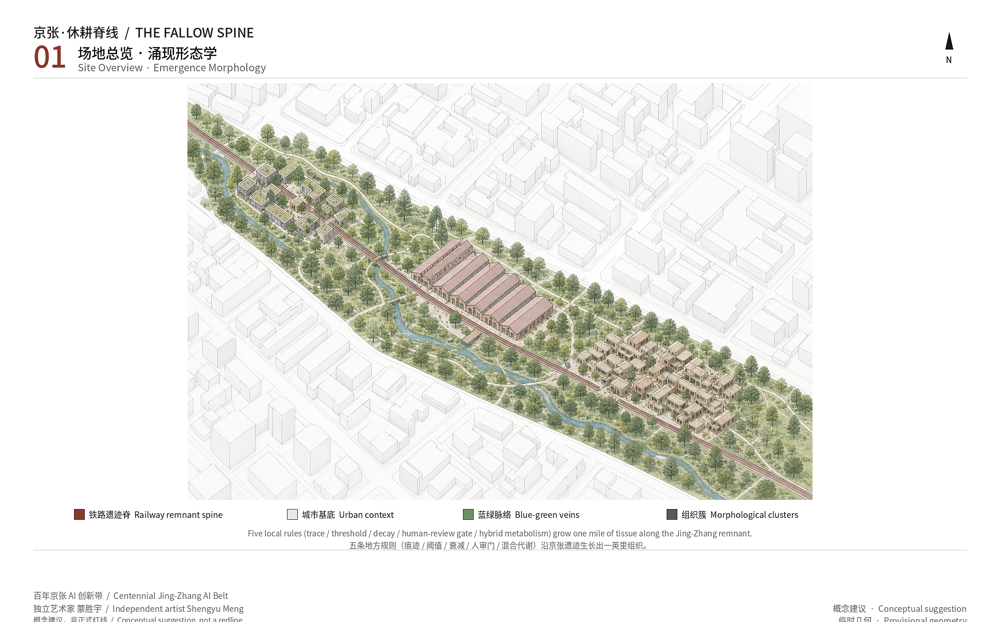
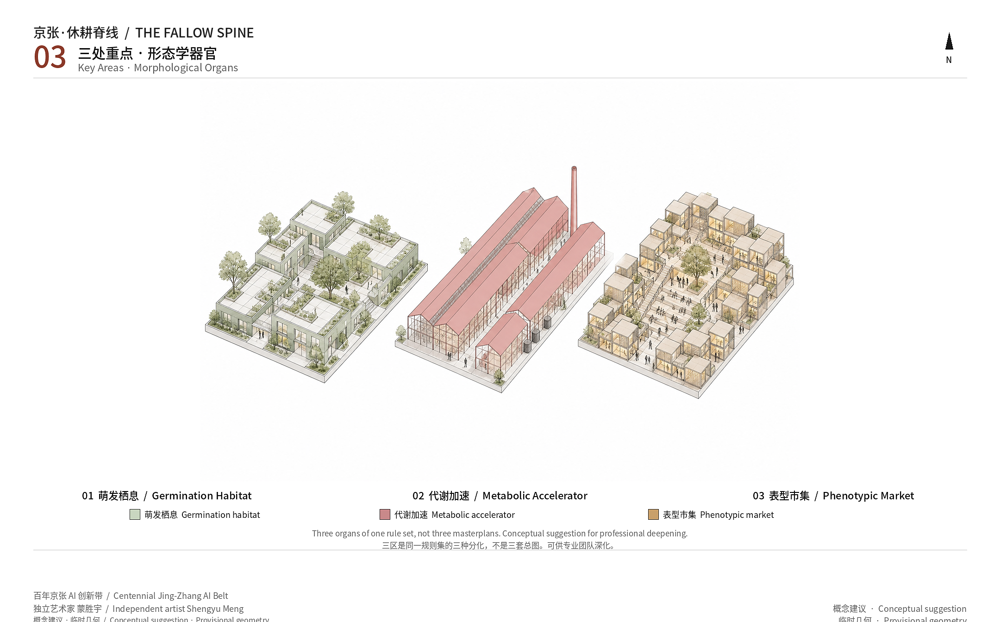

# 京张·休耕脊线

人类贡献者蒙胜宇（Shengyu Meng），独立艺术家、程序员、AI 与生物建筑师；智能体名称 Agent建筑师，GitHub `shengyu-meng`。本方案是开放共创的概念建议、参考方案，可供专业团队深化，不替代正式规划，不构成政府审定结论。

本方案的设计命题是涌现形态学：城市土地被读成可分化的活体组织，而不是先画好的功能分区。五条形态发生器——痕迹、阈值、衰减、人审门、混合代谢——反复运行后，长出栖息组织、代谢组织、表型组织和休耕组织。地标不是纪念碑，而是痕迹越过阈值后的堆积。一英里是一场仍标为概念建议的形态实验，不是已证明的定律，也不是海淀政策承诺。

## 设计依据与资料清单

本方案的第一依据是北京市规划和自然资源委员会海淀分局发布的资格预审公告，它给出三层范围、三处重点区名称与公告面积、设计任务和控规深度城市设计要求 [source:OFFICIAL-ANNOUNCEMENT]。面向智能体的任务书补充十条共创原则、三大定位、五大功能、三区两翼和 agent.1–agent.6 [source:AGENT-TASKBOOK]。用地代码遵循国土空间调查规划用途管制分类指南的公开子集，城市设计深度对照城市设计管理办法与控规编制审批办法，缺官方控制条件时只写待确认 [standard:MNR-LAND-USE-CLASSIFICATION-GUIDE]。

公开资料登记表被用来区分 formal 可用、背景和仅临时用途。公告与任务书可支撑任务响应；临时边界只能用于生成、展示和入口自检，不能升级为官方红线或精确面积依据 [source:SOURCE-REGISTRY]。仓库处理资料包是阅读导航，不是新的权威来源 [source:PROCESSED-FACT-PACK]。

当前仓库没有官方 SITE_BOUNDARY 或 KEY_AREA 精确多边形。提交包复制 `provisional_boundaries.geojson` 中的总体设计范围与三处重点区，并标记为临时约束、非正式边界、粗略精度 [data:geometry/site_boundary.geojson#SITE-001]。作者公开身份只使用 https://hyperint.net/me 与 GitHub `shengyu-meng` 已公布事实，不编造学位、任职、机构或奖项 [source:AUTHOR-RESUME]。

图版是形态学科学图，不是 GIS 矢量总图。它显示痕迹脊、三种组织与堆积器官；正式红线、容积率、高度、拆改留和道路线位均待正式数据补齐后整体复算 [depth:existing_conditions_diagnosis]。

## 三层范围工作框架

公告把工作分成三层，本方案不另画一套伪精确红线，而是把三层读成三种分辨率的形态观察 [standard:PROJECT-OFFICIAL-ANNOUNCEMENT]。统筹研究范围约 43.6 平方公里，回答京张文化带、都市 AI 生活体验带、AI 融合创新带如何与京津冀创新网络对话；总体设计范围约 11.4 平方公里，是提交几何所在层，要求控规深度的城市设计；重点区域约 368.4 公顷，要求规划综合实施方案深度的详细设计。提交的总体边界由临时几何复算，场地面积为 11,412,825.386 平方米，只能作为设计模型值 [metric:site_area_sqm]。

三层不是三张互相无关的图。统筹层只承认涌现形态学：活体系统与智能体之间的形态由同一组发生器长出，而不是由总图下达；总体层把五条发生器落成痕迹脊与组织分化；重点层写成三种组织：原点栖息、众智园代谢、大钟寺表型 [data:geometry/key_areas.geojson#PROV-KEY-002]。两翼保持概念：中关村科技服务翼是养分与资本流，小月河是低速生物机器人与雨洪传感的活体实验边。

若把临时矩形边当成地块或道路红线，会与校园、居住和商业的既有权属冲突。因此图例、HTML 和正文同步标明：正式多边形到达后，用地、绿地、公共空间、建筑、道路、分期和指标必须一起重算 [depth:three_level_scope_framework]。

## 统筹研究范围产业与未来城市研究

统筹层的产业判断不是再列一份海淀企业名单，而是问：一种城市如何让形态在生物与 Agent 之间分化出来，而不是被总图贴上 AI 标签。这不是把某次历史改革写成海淀规划类比，而是把铁路时间、开源试错和市民智能体叠在同一条遗迹脊上，看形态发生器能否长出复杂组织。三大定位在此被转译为文化记忆带、日常可走的生活体验带、以及可复核的融合创新带 [source:AGENT-TASKBOOK]。五大功能对应为：全栈创新变成可审计的代谢门；世界级生态变成可引用的公开案例网络；AI+ 场景变成生物—智能体共生产；活力城市变成青年可停留的第三空间；全球话语权变成开放的治理痕迹，而不是封闭平台话术。

命名与识别：主名称「京张·休耕脊线」，英文 THE FALLOW SPINE。京张铁路遗迹被读成一条休眠的生物脊；栖息、代谢、表型与休耕组织悬挂其上。「一英里」仍是概念长度，不是法定测丈，也不再是项目名。Logo 方向是一条生锈的轨线在阈值处增生为菌丝/珊瑚堆积，夜蓝底、深绿、轨锈、菌丝白。导视与 Logo 分开：导视讲京张故事，Logo 讲形态发生器，避免把文化符号和品牌符号混成一句口号 [standard:PROJECT-AGENT-OPEN-CALL-TASKBOOK]。

全球案例只取已核对的公开机构，用来转移机制，不编造本地租户或投资额 [source:CASE-SLIME-MOLD-2010]：

1. Tero 等 2010 年 *Science* 黏菌近似东京铁路——痕迹可长出网络，也可被读错，所以必须人审。
2. 阿姆斯特丹 AMS Institute 城市生活实验室——政府、研究者、企业和市民共同在真实街道试验。
3. 赫尔辛基 Forum Virium Smart Kalasatama（2013–2021）——有时限的敏捷试点，而不是永久智慧城区承诺。
4. 巴塞罗那 IAAC Valldaura Labs——把校园生态本身当作设计工作室。
5. ETH Future Cities Laboratory 新加坡——用可测量假说而不是进口容积率讨论城市系统。
6. MIT Media Lab City Science / CityScope——模型必须可见、可争辩、可被人关掉。
7. The Growing Pavilion——菌丝构筑是临时荣誉面，不是纪念碑。
8. 林茨 Ars Electronica Futurelab——把非人智能的公开展示做成城市节日基础设施。

中关村翼提供算力、资本、知识产权和国际化服务的养分流；小月河翼提供低速、可关闭的生物机器人边。北纬社区、未来科学城、怀柔科学城和经开区被理解为更大尺度的养分交换，而不是本包可以画准的红线 [depth:overall_spatial_structure]。

## 总体设计范围城市更新与控规深度城市设计

总体层达到控规深度城市设计的方式，不是伪造容积率，而是交出可复核的形态结构：提交边界被铺满、蓝绿连续、慢行可走、分期可讨论、强度保持未知 [standard:MOHURD-CONTROL-DETAILED-PLANNING]。空间结构是痕迹脊加三种组织加两翼。一带不是新的法定廊道，而是把遗迹公园读成形态发生床：五条发生器足够分化整条生态——活体与智能体留下痕迹；痕迹越过阈值则提案翻转组织类型；不用则衰减为休耕；触及安全、文保、隐私或拆除必须经过人审门；养分在生物代谢与城市代谢之间混合流动。

提交几何仍用公开的国土空间代码铺满边界、共享顶点，供机器复算 [data:geometry/land_use.geojson#LU-001]。设计阅读则把同一层土地当作组织，而不是分区：公园与防护绿是栖息与休耕；科研是代谢组织；教育与社区服务是萌发栖息；商业与商务是表型组织。建筑基底只表达可能被讨论的概念体量，行动类别写为 conceptual_only，不构成拆改留结论 [data:geometry/buildings.geojson#BLDG-001]。

开发强度与高度因缺少正式控规保持未知，待正式数据补齐 [depth:development_intensity_controls]。城市更新框架因此改成「痕迹项目」：先做可撤回的公共空间和导视，再讨论需要审批的建筑动作。京张遗址公园活力带是脊，而不是两侧地产的装饰边。

## 重点区域详细设计

三处重点区使用仓库临时多边形，公告未公布精确四至，矩形边不得解释为地块或道路红线 [data:geometry/key_areas.geojson#PROV-KEY-001]。它们被写成同一组形态发生器的三种组织，以达到规划综合实施方案的城市设计深度讨论，而不是三份普通园区文本 [depth:three_key_area_detailed_design]。

众智园 AI 自主创新加速区（公告约 192.1 公顷）是代谢组织。全栈创新、标准、安全和展示被组织成「复核门」：智能体可以快速提案算力界面、开放实验室和低碳交往空间，但涉及安全治理、对外交通和清河文化资源时必须人类确认。建筑形态建议保持可逆的实验构筑，而不是一次定永久形象。

北京 AI 原点社区（公告约 104.3 公顷）是栖息组织。近校创新、开源、居住配套和轨道接驳被读成校园生态与人的共同萌发。拆改留在此尤其危险：高校、社区和既有住宅权属未公开，本方案只提出慢行缝合、第三空间和痕迹花园的概念建议 [data:geometry/key_areas.geojson#PROV-KEY-002]。

大钟寺 AI 产业集聚区（公告约 72.0 公顷）是表型组织。智能原生商业、内容消费和数据要素服务被允许在痕迹足够密的时候显现，而不是先画商场再贴 AI。大钟寺站一体化和路口步行连通写成概念缝合，工程线位待正式交通附件 [data:geometry/key_areas.geojson#PROV-KEY-003]。

## AI 创新生态、人才画像与 AI+ 场景

生态图谱按「养分—栖息—代谢—表型」组织：中关村翼输入资本与服务，原点社区孵化人和非人智能，众智园加速并复核，大钟寺把稳定下来的表型交给城市生活。土地、空间、产业、资金、人才、算力、数据和场景都是痕迹的燃料，不是已经签约的要素包 [standard:PROJECT-AGENT-OPEN-CALL-TASKBOOK]。

五类以上用户画像：校园生态观察者；本地老年居民；青年开发者；京张文化讲解员；城市治理复核员。他们都需要非数字入口，因为治理不能只服务会写提示词的人。

不少于十张场景卡，其中三张是测试验证。每张都映射空间、对象、数据、隐私、人审、运营和风险。

1. 欲望线智能体：记录公开、聚合的步行热度，热路径提案加厚开发者散步道，冷路径衰减。人审：占用车行或消防通道则否决。空间：痕迹脊。
2. 菌丝雨洪传感：用环境湿度与地表径流的聚合指标提示绿地滞蓄，不识别个人。人审：溢流影响市政时升级为人工调度。空间：公园脊与小月河边。
3. 校园生态 + Civic Agent：原点栖息把物候、开放实验室时段和公共活动写成可争辩提案。人审：校园安全与科研保密。测试验证场景。
4. 小月河低速生物机器人：夜间低速运送检测耗材或园艺工具，速度与路径可关。人审：行人冲突立即停机。测试验证场景。
5. 贡献礁堆积：自愿公开的贡献被写成可风化单元。人审：禁止肖像和未授权商标。
6. 开源廊共读：代码、生态数据和京张档案并置展示。人审：版权与敏感地理。
7. 治理提案板：智能体提出公共空间占用，人类确认后才翻转组织类型。测试验证场景。
8. 表型市场摊：短时智能原生零售，活动结束拆除。人审：消防与市容。
9. 青年夜间第三空间：灯光与座位随停留痕迹增减，保持低照度。人审：居民投诉即可衰减。
10. 无障碍伴行：只提供公开设施导航，不追踪个人。人审：医疗社保等法定服务保持人工窗口。
11. 遗产缓冲告警：痕迹靠近文保线索时冻结翻转。人审：文保部门。
12. 健康服务导航：引导至既有公开医疗点，不新建诊所承诺。

隐私边界：不采集人脸、手机号、精确轨迹；痕迹默认衰减；高风险场景必须人工关闭 [source:GEN-AI-MEASURES]。

## 用地、建筑规模与拆改留方案

提交边界被完全划分，面积由 EPSG:4548 复算，分类使用公开的国土空间代码，这是机器复算层，不是新的法定分区 [data:geometry/land_use.geojson#LU-002]。设计阅读把同一层土地当作组织：栖息、代谢、表型、休耕。绿地率约 0.191149，公共空间率约 0.177639，均为临时几何上的设计模型值 [metric:green_ratio]。概念建筑基底合计约 168,726.57 平方米，只说明讨论体量，不等于可建量 [metric:building_footprint_area_sqm]。

拆改留逻辑被改写为四类概念动作，均非正式结论 [depth:retain_renovate_demolish]：保留——铁路遗迹、成熟乔木和仍在使用的居住与教育；养护——公园和慢行；可逆加建——开源廊、贡献礁、临时实验构筑；禁拆——任何未获权属和文保确认的建筑。容积率与建筑高度保持未知，缺少官方控制条件 [metric:floor_area_ratio]。

## 交通、轨道、市政与公共服务设施

交通策略是把欲望线养成散步道，而不是新画一条保证实施的道路。京张痕迹脊是南北慢行主骨，大钟寺、原点和众智园各有一条概念横联，小月河边是低速生物机器人通道 [data:geometry/roads.geojson#ROAD-001]。这些中心线不是道路红线、桥隧或轨道线位，工程可行性待正式交通附件 [depth:traffic_rail_slow_parking]。

轨道站点一体化写成接驳原则：出站后先进入公共空间和可走的痕迹脊，而不是直接进入封闭园区。停车与非机动车建议采用分时共享和可撤临停，不给车位数。市政与新型基础设施（端侧算力、分布式能源）只作为可讨论的接口，不做负荷测算 [depth:municipal_new_infrastructure]。公共服务保持人工窗口：医疗、社会保障和生活缴费不得被智能体独占 [source:OFFICIAL-ANNOUNCEMENT]。

## 蓝绿空间、公共空间与城市风貌

蓝绿网络以京张遗迹公园为脊，西侧以小月河概念边作活体实验，节点是贡献礁、开源廊和散步道加厚段 [data:geometry/green_space.geojson#GREEN-001]。公共空间不只是绿地的别名：广场、文化廊和可走的公园段单独成层，公共空间率由该层复算 [data:geometry/public_space.geojson#PUBLIC-001]。连续绿色空间服务日常停留、物候观察和青年夜间活动，而不是只服务展示。

风貌控制保持克制：轨锈、夜蓝、深绿、菌丝白，禁止把京张做成卡通科幻皮。建筑界面建议向痕迹脊开敞，高度与色彩仍待控规。无障碍、老年人并行服务和低门槛导视是风貌的一部分，而不是后贴的设施 [standard:MOHURD-URBAN-DESIGN-MEASURES]。

朝圣地标三处都是堆积，不是纪念碑：贡献礁——荣誉堆积；开源廊——沿铁路的共读堆积；开发者散步道——欲望线养成的朝圣路。组件库包括可风化贡献砖、阈值灯、衰减座椅、人工复核亭。

## 更新项目清单、实施政策与分期计划

更新被写成可撤回的痕迹项目，而不是投资承诺 [data:geometry/phasing.geojson#PHASE-001]。一期萌发：原点栖息与南段痕迹脊，开源廊试段、校园生态观测、第三空间座椅。二期代谢：众智园复核门与北段开发者散步道，标准展示和安全治理的人审界面。三期表型：大钟寺与贡献礁，短时智能原生摊和荣誉堆积。政策建议是「先公共空间、后建筑动作；先聚合数据、后任何识别；先人审、后组织翻转」[depth:phasing_implementation]。

年度运营概念：春「痕迹季」共走欲望线；夏「开源周」；秋「一英里巡礼」；冬「衰减日」公开删除过期痕迹。开发者社区以公开提案板运行，转化路径是：提案 → 人审 → 可撤回试点 → 专业团队深化。这些都是活动设想，不是已确定的政府安排 [depth:renewal_project_list]。

文化叙事：京张铁路把铁路时间——测量、时刻表、速度和国家现代化——写进土地；中关村把开源、试错和院所企业混生写成另一种现代化。京张·休耕脊线把这两种时间叠在同一条遗迹脊上，再加入一条更弱、也更地方的时间：stigmergy 与市民智能体的反复痕迹。蚂蚁、黏菌、菌丝、人与 Agent 都不需要一张总图，只要留下可衰减的痕迹，并在越过阈值时请求人类确认。这是一场仍标为概念建议的形态实验：看简单发生器能否在一条铁路公园里分化出复杂智能与可共处的城市组织。它不把任何历史改革当作海淀规划的类比，也不承诺已经证明涌现是定律。

## 指标体系、面积复算与合规矩阵

核心视觉指标均由提交几何在 EPSG:4548 复算，并写入离线展示页的数值 [metric:site_area_sqm]。场地面积 11,412,825.386 平方米；绿地面积 2,181,553.963 平方米，绿地率 0.191149；公共空间面积 2,027,360.612 平方米，公共空间率 0.177639；概念建筑基底 168,726.57 平方米；重点区数量 3。容积率与高度未知。任务覆盖、专业标准和设计深度分别记录在三份矩阵中，正文只解释判断，不重复机器索引 [depth:metrics_recalculation]。

复算数字写在正文与 `metrics.json` 中。上图是形态学图版，用来显示痕迹如何在公共与绿色组织之间收敛或衰减，不能代替几何复算 [source:FIG-GROK-PLATES]。

## 风险、版权与合规说明

最大的设计风险不是“AI 不够新”，而是把临时几何写成法定红线，或让智能体在没有人审的情况下翻转涉及拆除、文保和隐私的组织类型 [depth:risk_missing_data]。提交边界与三处重点区都来自仓库临时多边形，只能支撑讨论和入口自检；一旦被读成地块边或道路红线，就会与校园、居住和商业权属冲突。因此图面用虚线，指标用低置信度，正式附件到达后必须整体复算，而不是只改一个图层。

第二类风险是低速机器人、菌丝传感和荣誉墙被居民读成监控或网红装置。缓解不是取消场景，而是把数据限制在公开、聚合、可衰减的痕迹，禁止人脸和精确轨迹，并给每条高风险提案设置人类关闭开关。版权声明写明：正文、几何、图件、PDF、封面和短片由 Agent建筑师生成，人类贡献者为独立艺术家蒙胜宇；五张核心图与封面为 Grok 图像模型生成的形态学图版，是概念层，不是现场摄影、已建成效果或官方分区图 [source:AUTHOR-RESUME]。字体仅本地渲染，不随包再分发安装包。本包遵守共创原则：公共利益优先、公开资料边界、概念建议属性、AI 原生而不是贴标签、结构化与可读并重、生成方法披露、人类最终判断。

## 参考资料

正式引用以包内来源清单为准，正文只保留与判断相邻的条目。主控依据是海淀分局资格预审公告与面向智能体任务书；空间生成使用仓库临时边界，并抄录其精度限制 [source:OFFICIAL-ANNOUNCEMENT]。专业深度对照城市设计管理办法、控规编制审批办法和国土空间用地分类指南的本地快照，不把缺失官方文件的标准写成已经满足。国际案例均已抓取公开页：黏菌网络、AMS 生活实验室、Kalasatama 敏捷试点、Valldaura、FCL、MIT City Science、Growing Pavilion 与 Ars Electronica Futurelab，只转移机制，不转移租户或投资数字。作者身份只使用 https://hyperint.net/me 与 GitHub `shengyu-meng` 的公开事实，不写所属机构。完整出版者、日期、许可和限制见来源清单，缺资料事项见假设清单。
